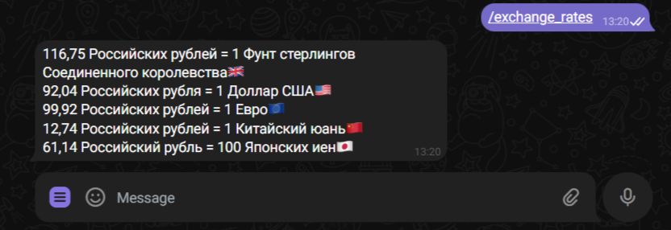
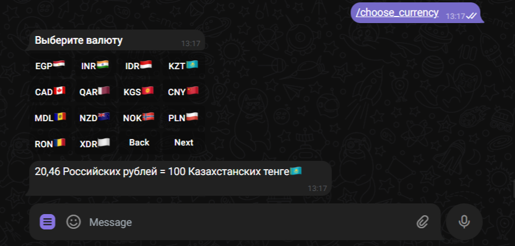
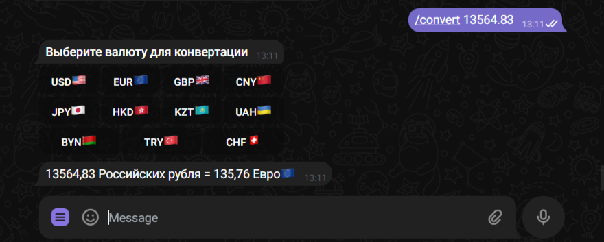
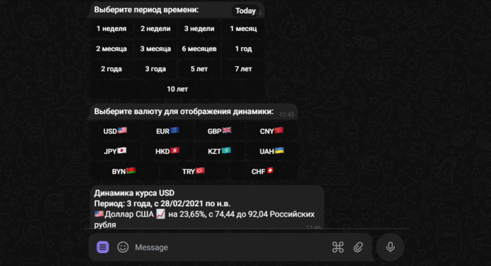

## Тимофеев Вадим

### Java-разработчик

### > `Телеграмм бот котировок валют, относительно рубля`

**Данный телеграмм-бот предоставляет актуальные `котировки валют`, 
основываясь на данных от Центробанка РФ**   

> На момент `28.02.24` - доступны 43 валюты Мира

`Используемые технологии:`

📌 API `Telegram-Bot`   
📌 API Курсы валют `Центрального Банка РФ` - для получения актуальных данных о котировках  
📌 ORM Hibernate - для осуществления CRUD-операций  
📌 СУБД MySql - для работы с реляционной базой данных  
📌 Docker-compose - для развертывания контейнера с базой данных  
📌 JAXB-библиотека - для работы с XML-формами ответов от ЦБ РФ   
📌 multithreading - под капотом ScheduledExecutorService - для рассылки курсов валют по подписке   
📌 stream-API - для чистоты кода  
📌 java.util.concurrent - для рассылки в заданное время  

### `Функционал бота:`

✅ /start - начало работы  
✅ /info - о боте  
✅ /exchange_rates - котировки топ 5 валют Мира  
✅ /exchange_rates_all - котировки всех валют Центробанка РФ  
✅ /choose_currency - выбрать конкретную валюту  
✅ /convert 1000 - конвертировать 1000 рублей в валюту на выбор   
✅ /subscribe - подписаться на рассылку курсов валют по открытию/закрытию   
Московской валютной биржи: 10:00 и 19:00 (будни)   
✅ /unsubscribe - отписаться от валюты  
✅ /dynamics - динамика курса валют за выбранный период  
✅ /feedback ваш текст - обратная связь  

`Немного о реализации:`  
- Использован `паттерн Строитель/Builder` в классе User
- базовые данные о пользователях сохраняются в БД для взаимодействия (id, имя, ник-нейм, множество (Set) подписок и фидбеки)
- база данных поднимается из контейнера с помощью `docker-compose` с монтированием общих попок с локальной машиной для  
сохранения реляционных таблиц
- для создания объекта класса SessionFactory использован `фабричный паттерн` в утильном классе HibernateSessionFactoryUtil
- Класс DaoImpl реализован `обобщенным`, для удобства обращения со всеми аннотированными классами (сущностями)

Скриншоты:  

`info`

`exchange_rates`

`choose_currency`

`convertation`

`subscription`

`unsubscription`

`dynamics`

